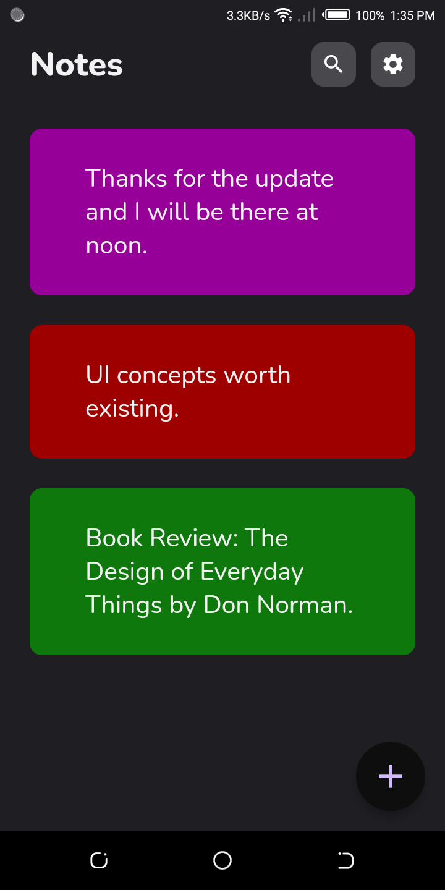
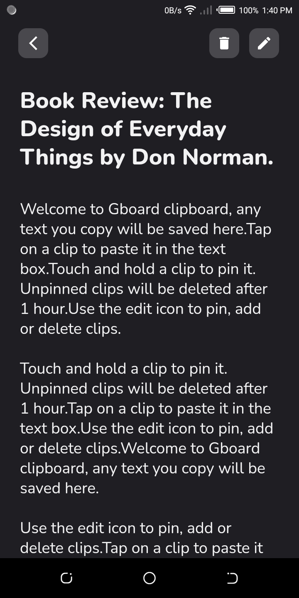
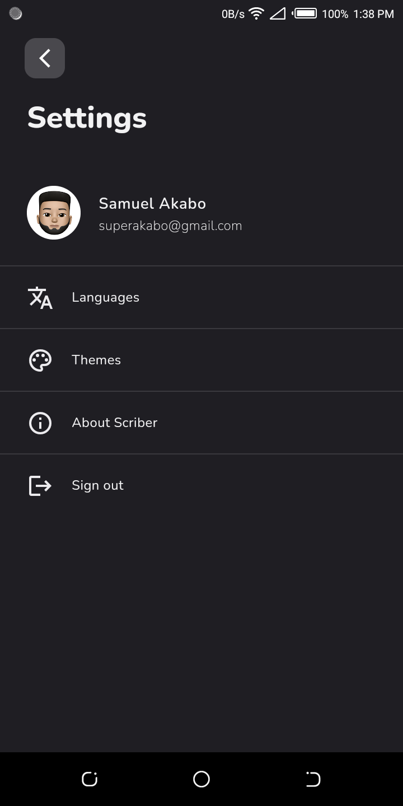
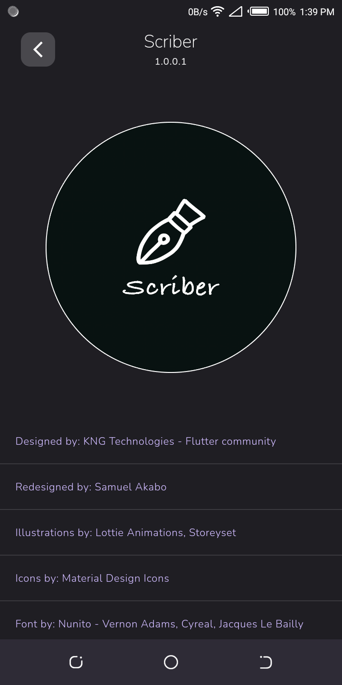

# scriber

Scriber is a simple and intuitive Notes app built with Flutter.

## Getting Started

Setup the [Flutter SDK](https://docs.flutter.dev/get-started/install) 
and clone this repository [Scriber](https://github.com/superakabo/scriber.git).

Create a project on [Firebase](console.firebase.google.com/) and install the
[FlutterFire CLI](https://pub.dev/packages/flutterfire_cli).

For help getting started with Flutter development, view the
[online documentation](https://flutter.dev/docs), which offers tutorials,
samples, guidance on mobile development, and a full API reference.

## Unit Tests

Run the command `flutter test test/tests.dart --dart-define=test_mode=true` 
to execute the unit tests. Tests will fail if `test_mode=true`
is omitted or set to false.

## Instrumented/Integration Tests

Run the command `patrol test --target integration_test/integration_test.dart --dart-define=test_mode=true`
execute the unit tests. Tests will fail if `test_mode=true` is omitted or set to false.

## Assets

The `assets` directory houses images, fonts, and any other files you want to
include with your application.

## Localization

This project generates localized messages based on arb files found in
the `lib/src/utilities/localizations` directory.

To support additional languages, please visit the tutorial on
[Internationalizing Flutter
apps](https://flutter.dev/docs/development/accessibility-and-localization/internationalization)

## Screenshots

<table>
  <tr>
    <td>
      
    </td>
    <td>
      
    </td>
    <td>
      
    </td>
  </tr>
  <tr>
    <td>
      
    </td>
    <td>
      
    </td>
    <td>
      
    </td>
  </tr>
</table>